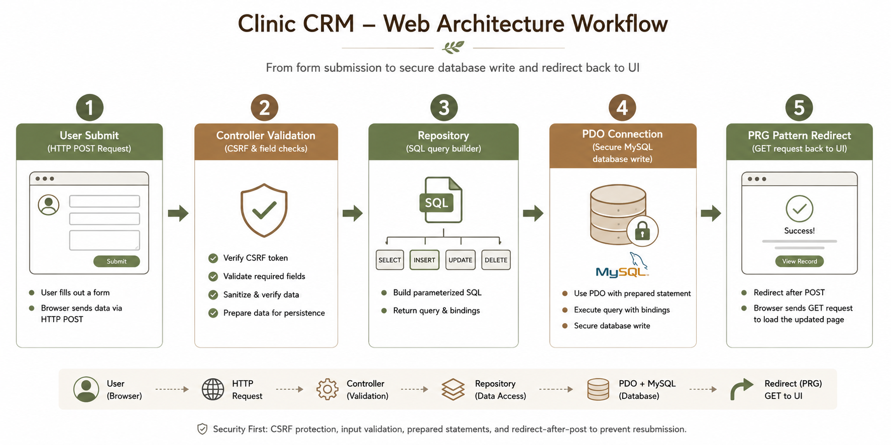

# Clinic CRM - PHP Lab05

Clinic CRM (Clinic Control Center) is a premium, lightweight web application for managing patient profiles and appointments. It is designed to be secure, fast, and robust, leveraging the **MVC** architecture and the **Repository Pattern** to decouple SQL execution from presentation logic.

---

## 📸 System Pipeline & Workflow

Here is the architectural pipeline and data flow of the system:



---

## 🚀 Key Features

*   **Architecture**: Strict MVC model combined with the Repository Pattern (`PatientRepository`, `AppointmentRepository`).
*   **Database Connectivity**: Secure MySQL connection via PDO configured with:
    *   `ERRMODE_EXCEPTION` (error mapping).
    *   `FETCH_ASSOC` (memory optimization).
    *   `EMULATE_PREPARES => false` (prevent SQL Injection).
    *   `utf8mb4` charset (multibyte character support).
*   **Security & Protection**:
    *   **SQL Injection Prevention**: 100% Prepared Statements for all parameters.
    *   **CSRF Protection**: Token validation on all mutable `POST` requests.
    *   **Secure Session Authentication**: Admin and Staff login/logout protection.
    *   **Input Validation**: Strict input filtering in Controller before saving to Database.
*   **User Experience (UX/UI)**:
    *   Premium Bento Grid dashboard.
    *   Smart sliding-window pagination (max 10 visible pages with ellipses `...`).
    *   Clean data tables with query strings preservation (`page`, `q`, `gender`, `status`, `sort`, `direction`).
    *   Whitelist sorting toggles (`asc`/`desc`).
*   **Safety & Performance**:
    *   **Soft Deletes**: Uses `deleted_at` column to prevent accidental database record loss.
    *   **Database Indexes**: Optimized using compound indexes and unique keys to speed up lookups.
    *   **Robust Logging**: Detailed error traces logged to `/storage/logs/app.log`, while users receive a clean 500 error view.

---

## 🛠️ Installation & Setup

### Prerequisites
*   Docker & Docker Compose

### 1. Build and Run Container
Spin up the PHP server and MySQL service:
```bash
docker-compose up -d --build
```
The application will be accessible at: **[http://localhost:8000](http://localhost:8000)**.

### 2. Seed Fake Data (Optional)
Generate 150 mock patients and appointments to test pagination:
```bash
docker exec -it php-web-lab05-app php seed_data.php
```

### 3. Run Integration Tests
Execute the local integration test suite to verify database functionality:
```bash
docker exec -it php-web-lab05-app php test_crud.php
```

---

## 🔑 Demo Access
*   **Admin User**: `admin@example.com` / `password123`
*   **Staff User**: `staff@example.com` / `password123`
